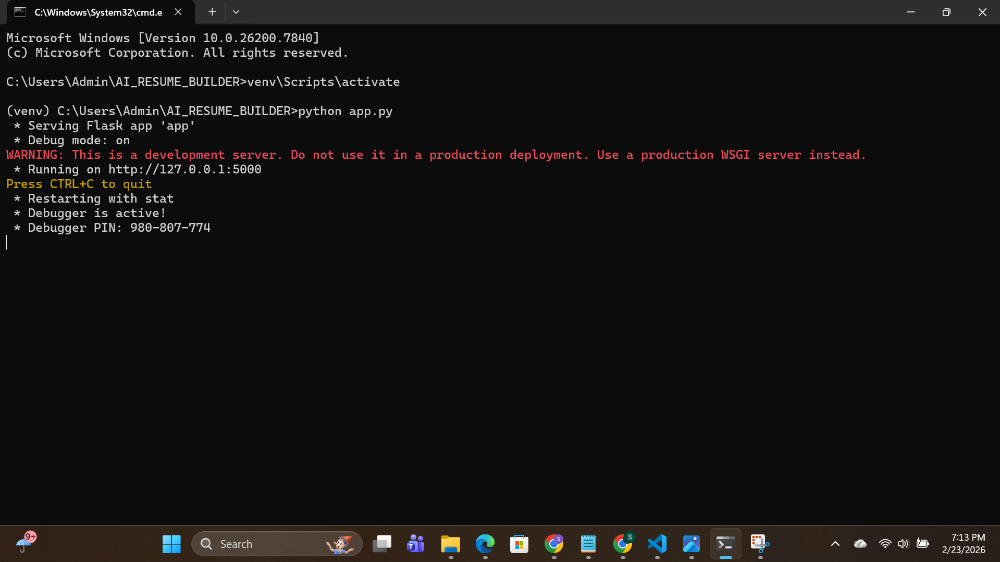
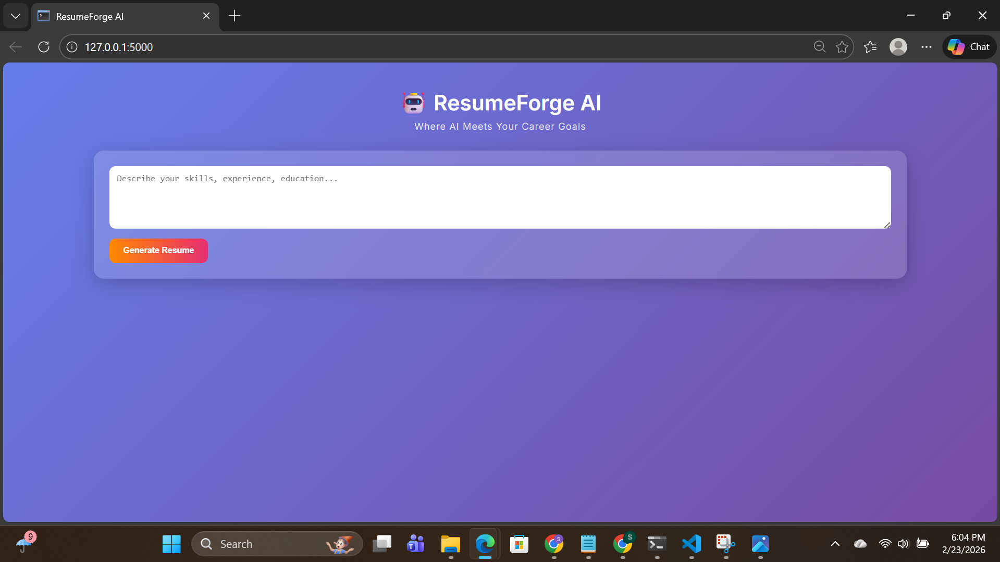
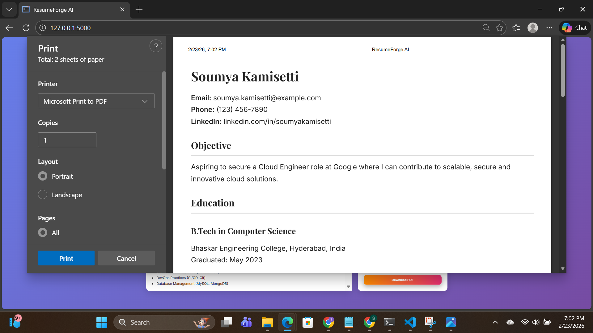

## 🤖 ResumeForge AI – AI Powered Resume Builder

## 📌 Project Overview

ResumeForge AI is a web-based application that generates professional, ATS-friendly resumes using Artificial Intelligence.

Users provide a prompt describing their skills, education and experience. The system generates a structured resume in HTML format, which can be edited and downloaded as a PDF.

## 🎯 Problem Statement

Creating a professional resume requires proper formatting, structured content and industry-relevant keywords. Many students struggle to build resumes that pass Applicant Tracking Systems (ATS).

This project simplifies resume creation using AI-powered automation.

## 💡 Proposed Solution

The proposed system is an AI-powered web application that :

* Accepts user input in prompt format

* Generates structured resumes using AI

* Displays editable resume preview

* Provides basic ATS analysis

* Allows users to download resume as PDF

## 🔮 Key Features

* AI-powered resume generation
* Clean and modern UI
* Editable resume preview
* Basic ATS analysis section
* Download resume as PDF
* Secure API key handling using environment variables

## 🛠 Technologies Used

### Backend

* Python 3.10.11
* Flask

### AI Integration

* OpenRouter API
* GPT-4o-mini model

### Frontend

* HTML
* CSS
* JavaScript

### Tools

* python-dotenv
* Git & GitHub

## ⚙ System Workflow

1. User enters prompt in the web interface.
2. Flask backend sends request to OpenRouter API.
3. AI generates structured HTML resume.
4. Resume is displayed in editable preview section.
5. User downloads final resume as PDF.

## 🖥 System Requirements

### Hardware

* Intel i3 or above
* Minimum 4GB RAM (8GB recommended)
* 5GB free storage

### Software

* Windows OS
* Python 3.10.11
* Virtual Environment (venv)
* VS Code
* Chrome / Microsoft Edge

## 🔐 Environment Setup

Create a `.env` file in the project root :

```
OPENROUTER_API_KEY=YOUR_API_KEY_HERE
```

Install dependencies:

```
pip install -r requirements.txt
```

Run the application:

```
python app.py
```

Open in browser:

```
http://127.0.0.1:5000
```

## 📸 Project Screenshots

### 🖥 Flask Server Running


### 🏠 Home Page


### ✍ Prompt Input


### 📄 Generated Resume & ATS Analysis


### 📥 Resume Download (PDF)


## 🚀 Future Scope

* Real-time ATS score calculation
* Multiple resume templates
* LinkedIn integration
* Cloud deployment
* Multi-language resume generation
* AI-based job recommendation system

## 📚 References

* OpenRouter – https://openrouter.ai/

* Python – https://www.python.org/

* Flask – https://flask.palletsprojects.com/

* GitHub – https://github.com/

* MDN Web Docs – https://developer.mozilla.org/

## 👨‍💻 Developed By

**Soumya Kamisetti**  
IBM SkillsBuild Virtual Internship  
AI-Based Project  
